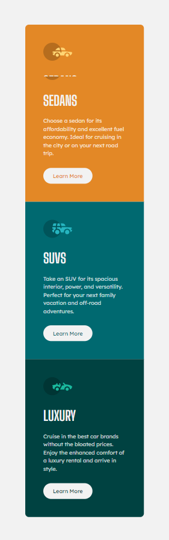

# Frontend Mentor - 3-column preview card component solution

This is a solution to the [3-column preview card component challenge on Frontend Mentor](https://www.frontendmentor.io/challenges/3column-preview-card-component-pH92eAR2-). Frontend Mentor challenges help you improve your coding skills by building realistic projects. 

## Table of contents

- [Overview](#overview)
  - [The challenge](#the-challenge)
  - [Screenshot](#screenshot)
  - [Links](#links)
- [My process](#my-process)
- [Built with](#built-with)
- [What I learned](#what-i-learned)
- [Continued development](#continued-development)
- [Author](#author)

## Overview 
Hello everyone! This is my solution to 3-column preview card component from front-end mentor! I hope you like it😁

### The challenge

Users should be able to:

- View the optimal layout depending on their device's screen size
- See hover states for interactive elements

### Links

- [Solution URL](https://github.com/HosseinHeydarpour/product-preview-card-component)
- [Live Site URL](https://hosseinheydarpour.github.io/product-preview-card-component)

## My process
 In my solution, I followed a desktop-first approach. For the overall layout, I used CSS Grid. As usual i used BEM and SASS together for a cleaner and more maintainble codebase.

### Built with
- Semantic HTML5 markup
- CSS 
- CSS Grid
- Desktop-first workflow
- SASS
- BEM methodology

### What I learned
This challenge helped me reinforce what i learned about CSS grid.

### Continued development
I still want to improve and enhace my abilities in CSS grid.

## Author
- Frontend Mentor - [@HosseinHeydarpour](https://www.frontendmentor.io/profile/HosseinHeydarpour)
- Linkedin - [@hosseinheydarpour](www.linkedin.com/in/hosseinheydarpour)
